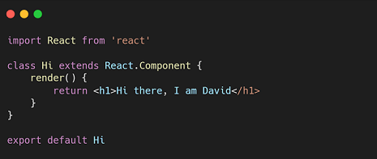

 

### I'm a Web Developer! 

- 🌱 I’m currently learning Firebase, Heroku, Node.js, React.js and Laravel ✨
- 👯 I’m looking to collaborate with other content creators
- 🥅 2020 Goals: Write cleaner code!
- ⚡ Fun fact: I'm interested in Russian martial art - Systema 😄

### Connect with me:

 

### Languages and Tools:

 
 

---

  
:zap: Github Stats

  

